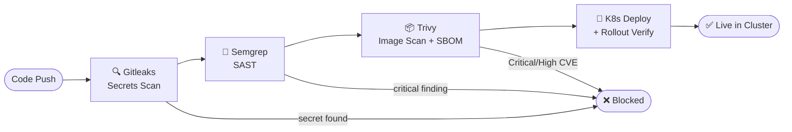
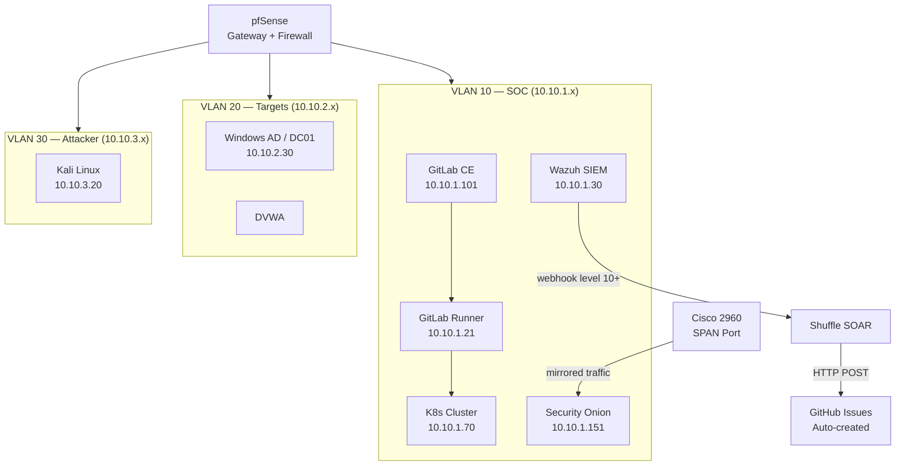

# Hi, I'm Tengku Rizal 👋

**DevSecOps Engineer** — I build secure CI/CD pipelines, automate threat response, and run enterprise-style security operations from a bare-metal homelab.

15+ years in network security, firewall operations, and vulnerability management — now applied to modern DevSecOps engineering.

---

## 🔐 CI/CD Security Pipeline

Pipeline enforces policy — builds are **blocked**, not just reported. Trivy configured with `exit-code: 1` on Critical/High severity.

---

## 🧪 Homelab Architecture

4 Mini PC i7 nodes · Proxmox · Cisco 2960 SPAN · WireGuard remote access

---

## 🛠 Tech Stack

**CI/CD & Pipeline Security**

**Kubernetes & Containers**

**Monitoring & Observability**

**SIEM, SOAR & Security Automation**

**Automation & Scripting**

**Network & Infrastructure**

---

## 📁 Featured Projects

### 🔒 [devsecops-homelab](https://github.com/TengkuRizal/devsecops-homelab)

End-to-end DevSecOps lab covering secure pipelines, Kubernetes, SIEM-driven SOAR automation, and network security monitoring.

| Component | What was built |
|---|---|
| **CI/CD Pipeline** | 4-stage security pipeline — Gitleaks → Semgrep → Trivy (enforced gate) → kubectl deploy |
| **SBOM** | Syft generates CycloneDX SBOM per build, stored as pipeline artifact |
| **Kubernetes** | 3-node kubeadm cluster — Calico CNI, containerd, local-path-provisioner, metrics-server |
| **Observability** | kube-prometheus-stack — Prometheus scraping cluster metrics, Grafana dashboards |
| **Wazuh SIEM** | Agents on Windows AD, Linux servers, Kali — full attack simulation with verified detections |
| **SOAR Automation** | Wazuh level 10+ → Shuffle webhook → GitHub Issue auto-created with triage checklist |
| **Python Triage** | `wazuh_triage.py` — queries Wazuh REST API, classifies alerts by severity + rule group, hourly cron |
| **Network Security** | Security Onion + Zeek via Cisco SPAN — wire-level traffic capture and analysis |
| **Network Segmentation** | pfSense VLAN 10/20/30 — SOC, Targets, Attacker isolated with enforced firewall policy |
| **Attack Simulation** | Kali vs Windows AD + DVWA — SSH brute force, AD recon, web attacks — all detected and correlated |

---

### 🐍 wazuh-triage *(coming soon)*

Standalone Python automation for Wazuh alert triage.

- Queries Wazuh REST API — no external dependencies, standard library only
- Classifies alerts by severity level and rule group
- Outputs structured triage report — top offenders, per-agent breakdown, top 5 critical alerts
- Runs hourly via cron

---

## 📈 Currently Adding

- [ ] Terraform + Checkov — IaC security scanning in pipeline
- [ ] Falco — Kubernetes runtime threat detection
- [ ] HashiCorp Vault — secrets lifecycle management
- [ ] GCP Security Command Center — cloud security posture

---

## 📫 Contact

Open to **DevSecOps** and **Security Engineering** roles in Malaysia.

