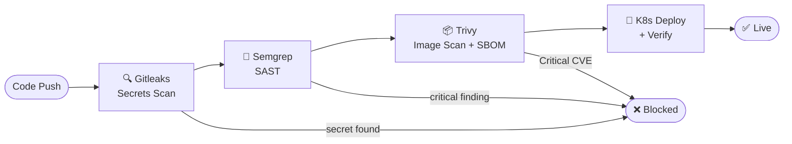
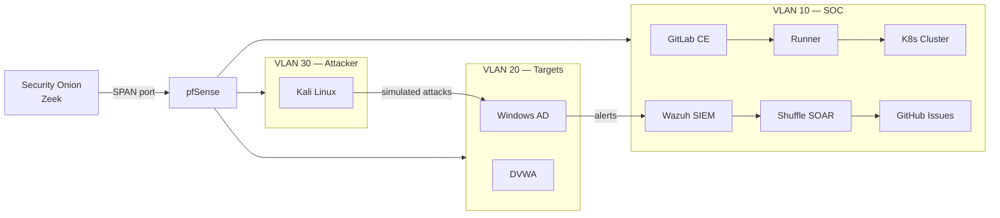

# Hi, I'm Tengku Rizal 👋

**DevSecOps Engineer** — I build secure CI/CD pipelines, automate threat response, and run enterprise-style security operations from a bare-metal homelab.

15+ years in network security, firewall operations, and vulnerability management — now applied to modern DevSecOps engineering.

---

## 🔐 What I Build

Pipeline enforces policy — builds are **blocked**, not just reported.

---

## 🧪 Homelab

4 Mini PC nodes · Proxmox · Cisco 2960 SPAN · WireGuard remote access

---

## 🛠 Tech Stack

**CI/CD & Security Gates**

**Kubernetes & Containers**

**SIEM & Security Automation**

**Network & Infrastructure**

---

## 📁 Projects

| Repo | What it does |
|---|---|
| 🔒 [devsecops-homelab](https://github.com/TengkuRizal/devsecops-homelab) | Full homelab — pipeline, K8s, SIEM, SOAR, network segmentation |
| 🐍 [wazuh-triage](https://github.com/TengkuRizal/wazuh-triage) *(coming soon)* | Python automation — Wazuh REST API alert triage + structured reporting |

---

## 📈 Currently Adding

- [ ] Terraform + Checkov — IaC security scanning
- [ ] Falco — Kubernetes runtime threat detection  
- [ ] HashiCorp Vault — secrets lifecycle management

---

## 📫 Contact

Open to **DevSecOps** and **Security Engineering** roles in Malaysia.

